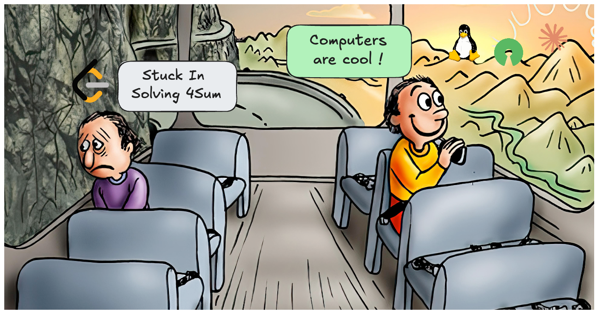
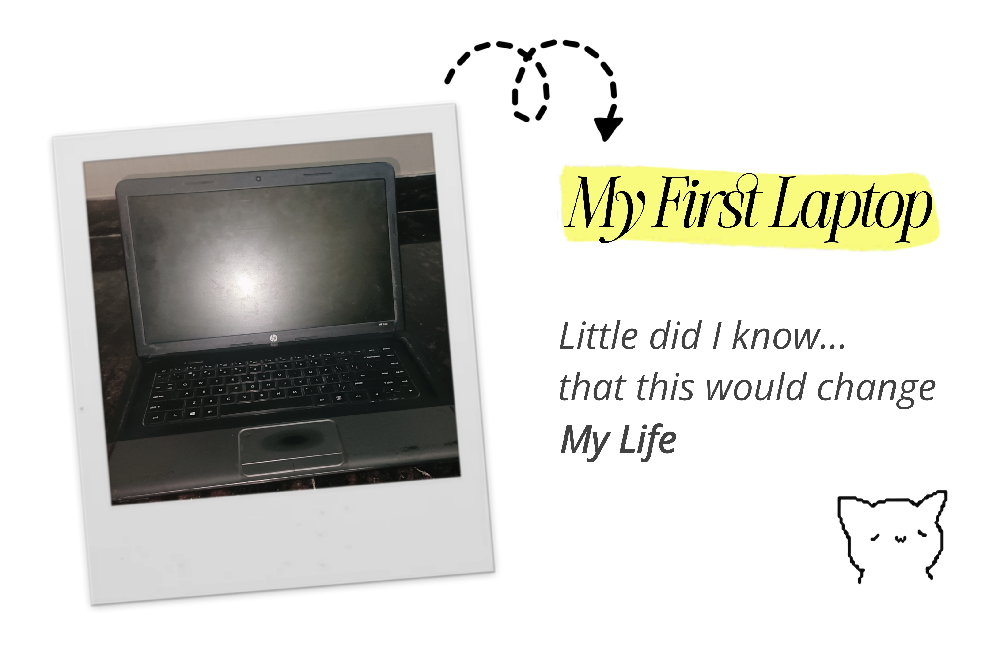

Can we talk about leetcode for a minute?

Seriously, What the hell are we spending our time on?

## The Problem With the LeetCode Grind

Give any LeetCode problem to an AI, and it can solve it in a couple of minutes.

If that’s the reality now, **why are we still grinding hundreds or thousands of problems?**

Honestly, I’m bored of solving the same patterns again and again. People talk about “mastering” problems, but the truth is:
> Nobody remembers how to solve every problem they solved months ago

Unless you’re an AI… or an Asian. (those guys are just on another level)

It’s not even a **skill issue**. A lot of these problems require remembering subtle tricks or patterns. When you grind them repeatedly, you’re not really learning - You’re **memorizing nuances**.

Real problem solving requires **time to analyze and think**.

But grinding 1000+ problems forces you to **recall patterns, not think**.
## We're Solving The Wrong Problems

Look around you

There's so much more interesting stuff:
- Learning Linux
- Understanding how OS works
- Exploring AI, MCP, Orchestration
- Diving into awesome Open Source Projects 
- Contributing to Open Source
- Building Automations
- Learning how to scale real apps

There's an entire universe of things that are actually interesting and useful.

And more importantly, there are **real, unsolved problems**.

Meanwhile we’re spending hours mastering interview puzzles. **Not one, not two, but thousands.**

## But Recruiters Care About It, Right?

Yeah, sure. Many companies still use DSA interviews.

But honestly, what sounds cooler?
- Solving **3000+ LeetCode problems**
- Or running **Arch Linux**, automating stuffs, building stuff, and having a crazy Neovim setup?

One is grinding puzzles.

The other is **building and understanding real systems**.

## The Reason I Got Into Computers

I was excited about computers in my childhood, not because it would get me a job and pay well. I did, because it was fascinating, exciting and FUN.

- Playing GTA Vice City, Doom was fun.
- Setting cool wallpapers and screensavers in your old windows laptop was fun.
- Opening the terminal for the first time was fun.
- Writing your own tiny C++ programs in Turbo C that did some basic math and feeling ridiculously proud that it worked was fun.
- Building your first little tool, like a GPA calculator cause you needed it, was fun.
- Watching your site go live and refreshing the page 10 times, just to see it worked, was fun.

Computers were -- and still are -- fun.

The fun wasn’t in chasing optimization tricks or memorizing patterns.

Leetcode is not fun 
(Atleast, not for me)

## A Better Way To Look At This

**Learning DSA Matters, But grinding 1000 problems Does Not**

Let’s be clear about one thing: **DSA is important.**

Stuff like `Trees`, `Graphs`, `Recursion`, `Hash maps`, `Linked lists` are fundamental ideas in computer science, They show up everywhere. 

Learning them is absolutely worth your time.

But there’s a big difference between **learning something new** and **grinding same pattern again and again**.

Solve a few problems to understand how these structures work. 

That's valuable.

What isn’t valuable is solving **hundreds or thousands of problems just to memorize patterns** for interviews.

There are amazing competitive programming platforms like Codeforces, CodeChef, AtCoder.

If you enjoy competitive programming, go all in. Compete, Solve, Climb the rankings,  become a Grandmaster or something.

But doing it not because it's fun, but **only because companies demand it** is where things become messed up.
## So Leetcode is the problem, Right?

The problem isn’t even LeetCode itself.

The problem is the **culture we built around it**.

The culture where:
- “Solve the **Top 100 FAANG Repeated Questions**”
- “Comment CheatSheet to Get 2026 FAANG CheatSheet”
- “Memorize these patterns and you'll crack any interview”

somehow became the holy grail of becoming a good engineer. 

It isn't.

And honestly, the problem isn’t the platforms.

**The problem is us.**

We turned interview puzzles into the ultimate benchmark of engineering ability.  

> Personally, I’d take **real system knowledge** over a **3000+ LeetCode badge on LinkedIn** any day.

## Final Thoughts

I did waste my time on this for a long time.

Following a DSA sheet. Solving every problem. Taking notes. Then coming back after a month to solve them again.

But recently, I met some cool people doing things I actually found exciting. They knew a lot of stuff about systems. 
- running their own homelabs
- customizing Linux setups
- contributing to open source
- understanding how systems really work
All the stuff I always wanted to explore.

Yet I kept pushing those things aside because _“I should probably solve a few more LeetCode problems first.”_

Looking back, that was probably the wrong priority.

This post is mostly a reminder to myself that:

You have two choices

Follow the boring manual and be the 1001st guy, who did the same thing successfully.

Or take a leap of faith on what your heart says. Because in the end, all that really matters is that you had fun along the way.

Have fun.
