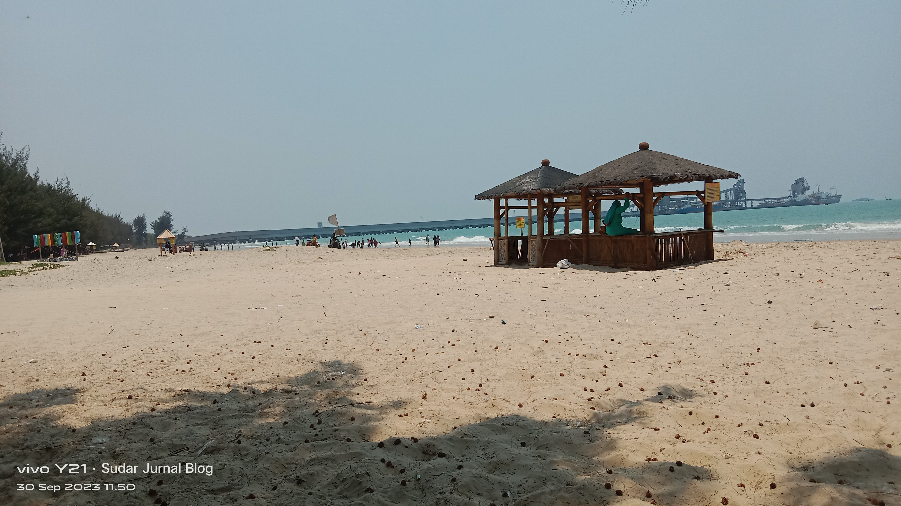
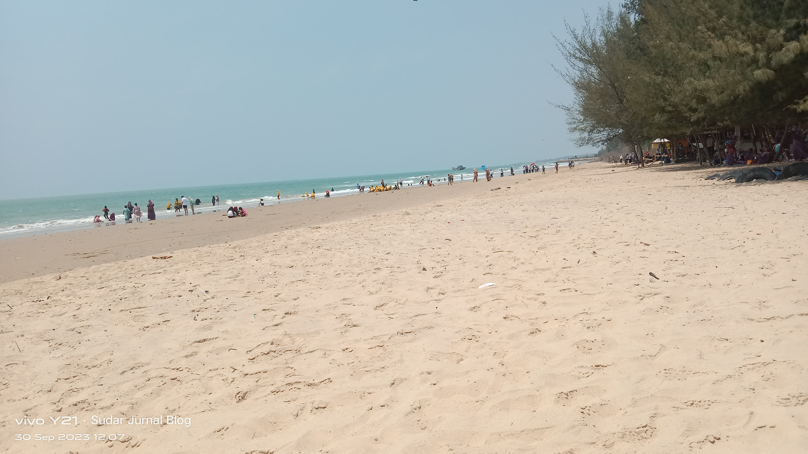

Lanjut Kluyuran di Tuban Episode 3: Indahnya Pantai Semilir Tuban Seperti di Bali yang akan di bahas pada kali ini. Setelah dari Air Terjun Ngelirip maka tujuan selanjutnya ke Pantai Semilir ini. 

Banyak yang mengatakan kalau pantai semilir tuban ini pemandangan nya sangat indah dan perjalanan dari Air Terjun Ngelirip pun tidak lah jauh sekitar 40 menitan ya sekitar 30 km lah. 

 

Berangkat dari Air Terjun Ngelirip ini pada pukul 10.30 dan sampai disana sekitar jam 12 siang. Sepanjang perjalan ke pantai banyak wisata yang bisa di jelajahi. 

## Harga Tiket Masuk Pantai Semilir Tuban
Apa tiket masuk pantai semilir ini mahal? Tentu tidak karena kalian hanya cukup membayar 5 ribu saja sudah bisa keindahan pantai semilir ini. 

 

Untuk tiket masuknya itu tidak ada ya kalian hanya cukup bayar parkir sepeda motor aja, untuk jam buka pantai semilir ini mulai jam 08.00 sampai 17.30 jadi kalian bisa menikmati sunset yang indah pada pantai ini. 

## Alamat Pantai Semilir Tuban
Untuk alamatnya sendiri berada di Jl. Nasional 1, Dusun Karangdowo, Desa Socorejo, Kecamatan Jenu, Kabupaten Tuban, Jawa Timur, 62352.

 
Karena dari Air Terjun Ngelirip hanya 40 menitan akhir saya memutuskan kesana sekalian ya walaupun trabas panas tidak karuan yang penting sampai sana dan bisa santai - santai disana. 

Beda dengan pantai yang ada di tuban lainnya pada pantai semilir ini kalian tidak ada tiket masuk hanya membayar tiket parkir sesuai kendaraan kalian. 

Tidak hanya pantai saja yang indah kalian akan melihat kapal besar lalu lalang pada pantai tersebut di karenakan pantai tersebut dekat dengan pabrik semen gresik. 

Walaupun panas banget di pesisir akan tetapi di pantai semilir ini sangat lah sejuk karena ada banyak sekali pohon cemara di sekitaran pantai ini.

Ditambah lagi ombak yang begitu besar jadi sangat indah dan cocok untuk menenangkan pikiran. 

## Fasilitas di Pantai Semilir Tuban
Untuk fasilitas pada pantai ini ada toilet, kamar mandi, wahana bermain, dan masih banyak lagi, apabila kalian ingin menyewa speed bot atau keliling pantai dengan speedbot juga bisa lho. 

 

Jadi di pantai semilir ini kalian tentu tidak akan bosan walaupun berlama - lama di pantai ini karena banyak wahana yang bisa kalian coba. 

Apa kalian lapar atau haus, tenang sob di pantai ini juga banyak yang jual makanan atau minuman dengan harga yang berfariasi mulai dari 4 ribu untuk minuman nya dan 10 ribu untuk makanannya. 

Tapi saran saya lebih baik bawa bekal dari rumah dan sewa tikar disana karena untuk sewa tikar itu sendiri dihargai sekitar 10 ribuan. 

## Akhir Kata
Mungkin Episode 3 ini adalah kluyuran tujuan akhir di tuban karena untuk ingin ke tempat lain pun waktu nya tidak memadai, bahkan perjalanan sampai rumah pun sekitar 2 jam dari tuban ke lamongan. 
