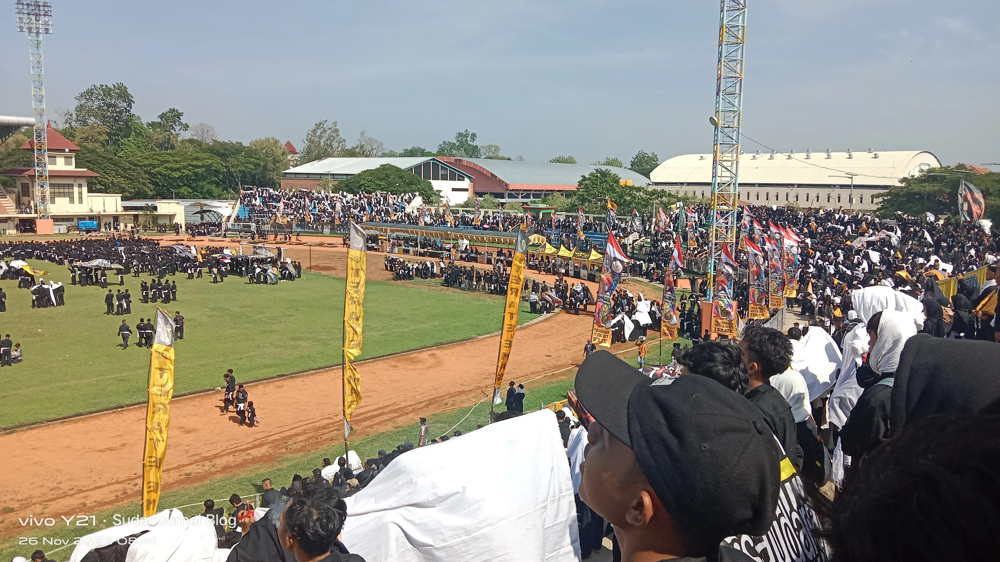
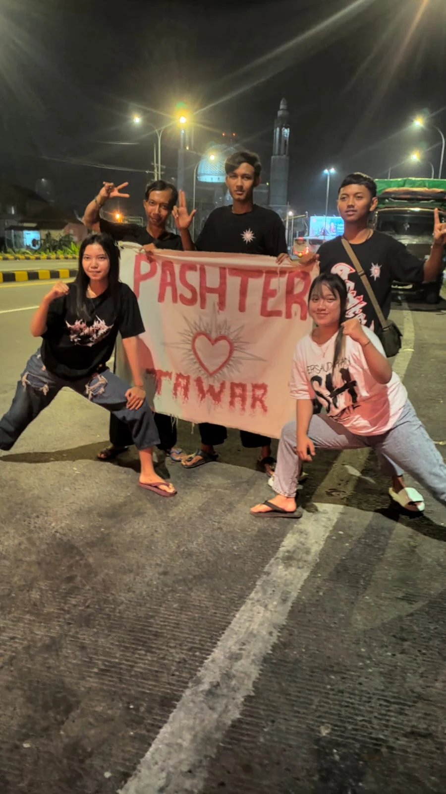
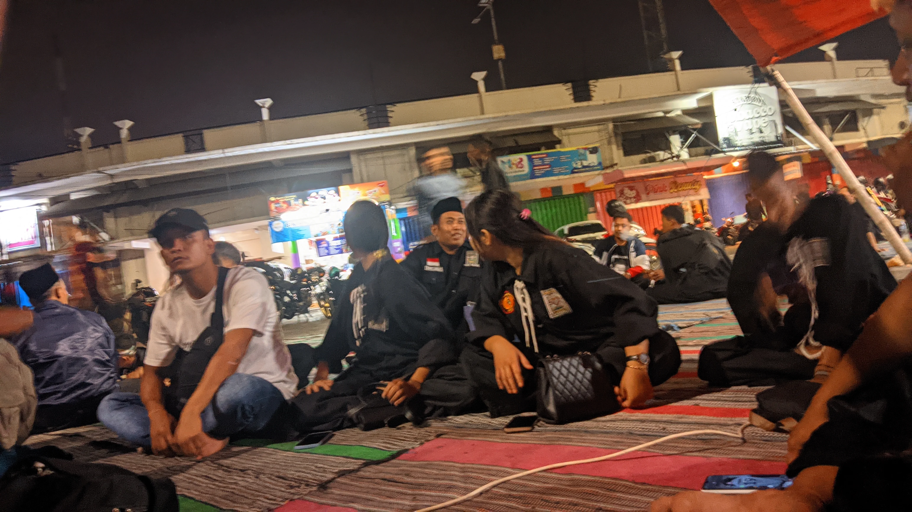

---
title: Deklarasi Pemilu Damai 2023 di Madiun Bersama SH Terate
description: >-
  Temu kandang Sh Terate Pusat Madiun Dalam Acara Deklarasi Pemilu Damai di Stadion Wilis Minggu 23 November 2023
date: '2023-11-29'
tags:
  - history
  - shterate
banner: null
is_draft: false
can_skip: false
---

Keinginan pingin ke mediun akhirnya tercapai dimana ini untuk menghadiri Temu Kandang dan Deklarasi Pilpres Damai 2024 di Stadion Wilis Kota Madiun.

Tidak hanya lamongan saja yang berangkat ke madiun untuk menghadiri acara tersebut hampir semua PSHT yang ada di jawa timur pun datang kesana.

Ada sekirtar 20 ribu warga yang datang dalam acara tersebut, bahkan PSHT asal jember menggunakan armada bus yang jumlah nya sekitar 33 bus serta 2000 warga yang datang ke acara Temu Kandang ini. 

Kalau Rayon Kedungmentawar ini sendiri berangkat malam dimana berangkat nya pada puku 20.00 wib yang mana berangkat nya pun dari tempat latihan PSHT Rayon Kedungmentawar ini. 

Alasan berangkat malam ini sendiri supaya menghindari macet karena acara tersebut tentunya banyak lah yang datang dari seluruh jawa timur ini.
 
Setalah perjalanan 2 jam akhirnya istirahat sejenak di Tol Nganjuk yang mana sambil nunggu Rayon Suco, Kabuh, Jombang. 

Sambil menunggu ya tentu saya manfaatkan untuk foto lah karena momen ini tidak akan datang dua kali. 

Hampir 20 menit menunggu akhirnya PSHT dari Rayon Suco pun datang, tapi tidak langsung berangkat kami pun juga foto lagi agar bisa dibuat untuk kenangan. 

Perjalanan pun di lanjut lagi yang mana dari jalan masuk tol masih jauh hampir sekitar 2 jam dari kota madiun. 

Satu perjalan pun kami lalui, memutuskan untuk istirahat lagi di res area tol untuk kencing dan istirahat juga. 

Karena banyak yang ingin buang air kecil, dari awal tol masuk sampai ke res area ini mungkin perjalan sekitar 1 jam lebih, dalam perjalanan juga banyak rombongan yang datang ke madiun untuk hadiri acara tersebut. 

Setelah istirahat selama 20 menit di res area Tol Nganjuk Madiun akhirnya melanjutkan perjalanan lagi ke Madiun, tujuan awal langsung ke Stadion Wilis Madiun, ternyata perjalan dari res area yang kami istirahat tadi masih lumayan jauh lah sekitar 1 jam lebih. 

Sampai nya di Stadion Wilis rombongan kami pukul 02.00 WIB dimana disana sudah ramai banget ditambah lagi penjagaam mulai dari TNI, Polisi juga Pamter sangatlah banyak dimana - mana. 

Sembil menunggu pagi akhirnya mencari makan dulu, karena perjalan yang jauh tentu membuat perut kami keroncongan, di Stadion Wilis ini banyak sekali yang jual makanan atau minuman dengan harga terjangkau sekitar 10.000 untuk nasi pecel.

Banyak pedagang yang menjual Nasi Jotos kaya apa rupa dan rasa nya juga saya belum tau, kayaknya mirip seperti nasi pecel. 

Setelah melanjutkan makan akhirnya istirahat sambil tidur atau minum kopi, dengan perjalan yang sangat jauh sekitar 4 jam tentu banyak yang kelelahan. 

Acara Deklarasi Pemilu Damai dan Temu Kandang 2023 di Stadion Wilis ini dimulai pada pukul 06.00 pagi yang mana nanti nya ada penampilan dari Reog dari PSHT Ponorogo. 

Untuk para warga yang ingin memasuki wilayah stadion ini harus menggunakan pita yang mana warna pita ini sudah di sesuaikan sesuai zona masing - masing, untuk area lamongan sendiri ini menggunakan pita warna kuning ke emasan. 

Karena berangkat kemarin kurang informasi jadi rombangan kami tidak masuk ke area stadion karena tidak memiliki pita yang di maksud. 

Tapi alhamdulillah karena dapat bantuan dari dulur kabuh akhirnya bisa masuk juga ke stadion wilis dan bisa menyaksikan acaralah tentu nya. 

Deklarasi Pemilu Damai dan Temu Kandang ini seharusnya di datangi oleh 3 Paslon akan tetapi nyatanya hanya satu aja pasangan Paslon Capres yang datang di Acara tersebut. 

Acara pertama di buka dengan apel pembukaan yang mana dilaksanakan pada pukul 08.00 hampir seluruh warga PSHT ini masuk ke stadion wilis itu kurang lebih ya 16 ribuan warga. 

Setelah apel selesai ada penampilan Reog Ponorogo yang mana saya tidak sempat menyaksikan nya,

Saya sendiri tidak menyaksikan sampai selesai apalagi kalau ada unsur kampaye sebenarnya sangat lah malas untuk menyaksikan nya. 

Ditambah lagi perut juga sudah lapar karena acara nya sedikit molor dari jam yang telah di tentukan. 

Ku kira makanan di madiun itu mahal - mahal ternyata tidak juga kalian untuk membeli nasi pecel aja itu pun hanya 10 ribu sudah dapat telur juga. 

Yang bikin penasaran itu saya dengan Nasi Jotos bagaimana rasanya dan Bentuk nya, karena namanya juga unik sihhh. 

Akhirnya memilih untuk keluar cari makan dan tidak ingin lagi masuk ke Stadion Wilis ini lagi, lebih baik langsung ke mobil untuk mandi dan istirahat disana. 

