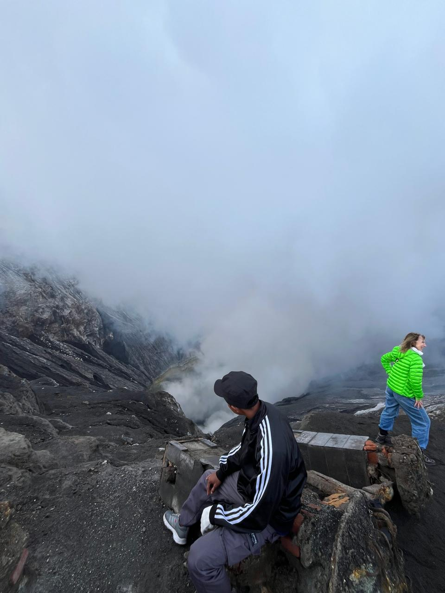
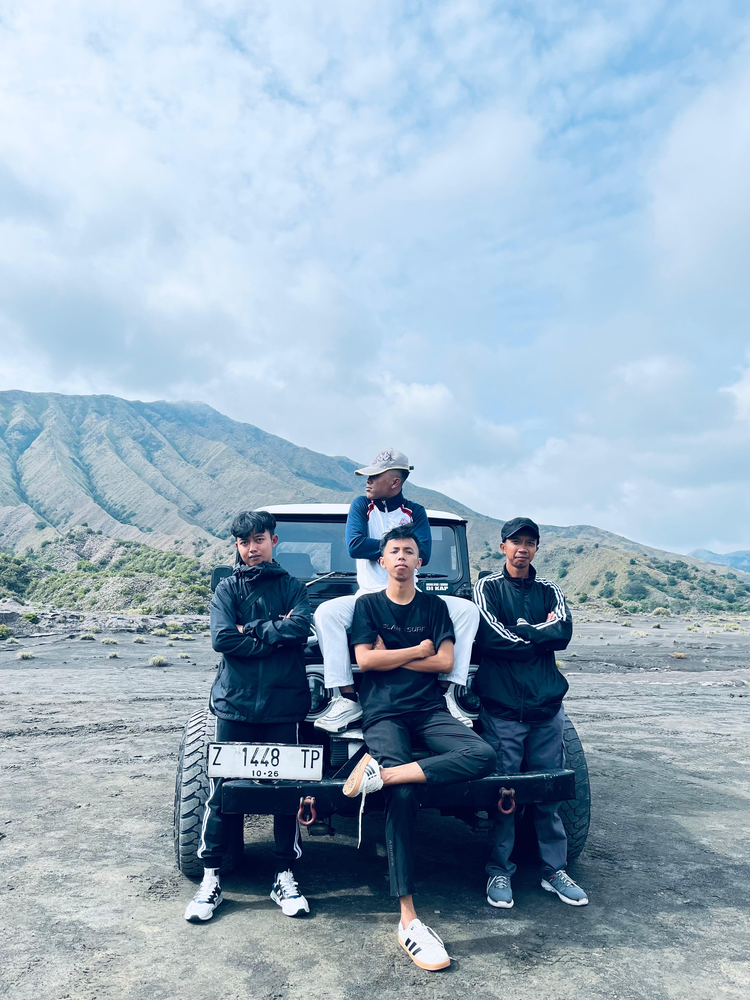
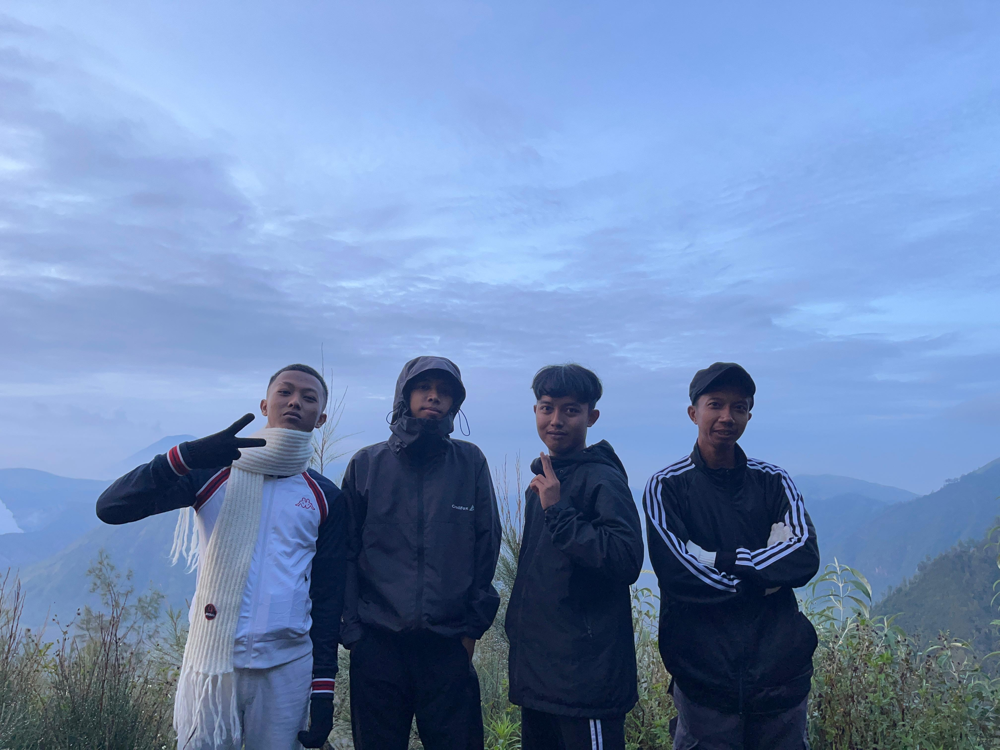
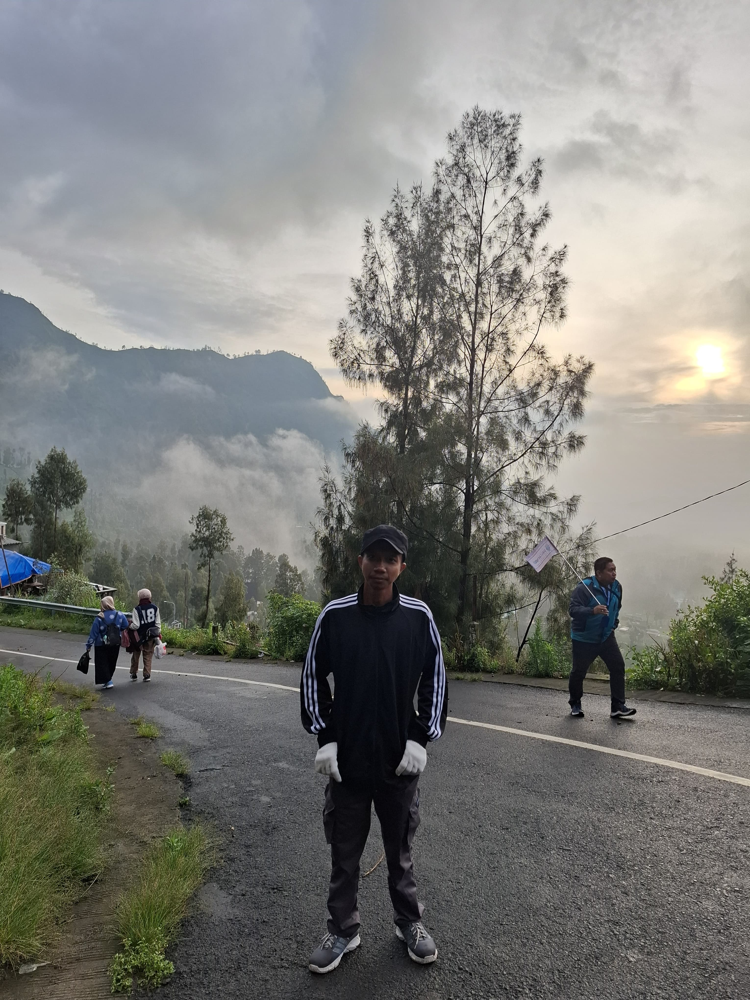
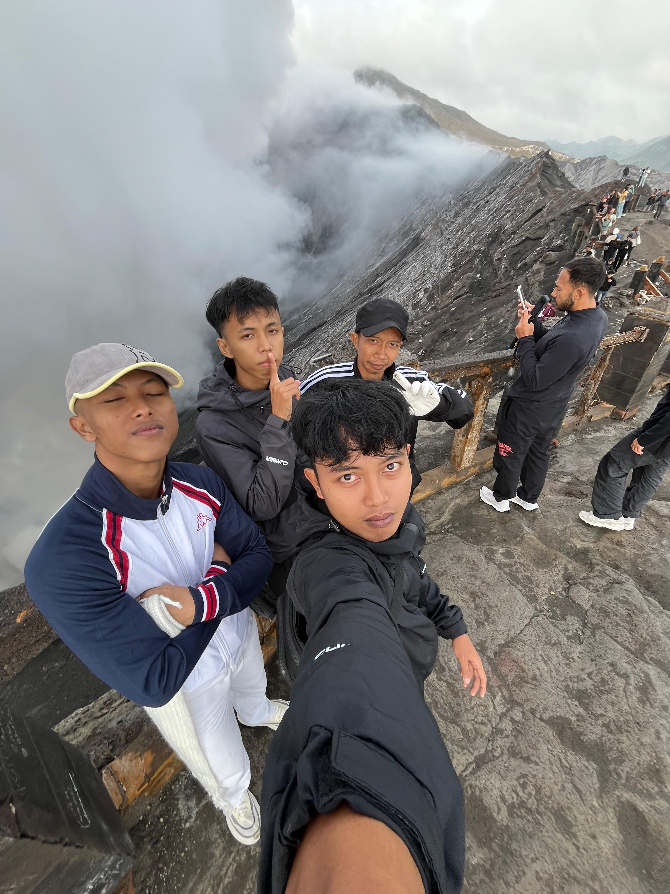

Bromo memang tempat yang indah untuk dikunjungi mulai dari wisatawan lokal hingga wisatawan mancanegara banyak sekali datang ke bromo, menjelang akhir tahun 2025 yang kedua kali nya berkunjung ke bromo. 

Namun yang sekarang sangatlah karena berkunjung kebromo melalui jalur probolinggo, sedangkan yang dulu melalui malang, sekarang menggunakkan privat jeep atau menyewa jasa traveller bromo sedangkan yang dulu menggunakan sepeda motor. 

Berangkat dari subaya menuju probolinggo dimana melalui tol memakan waktu dua jam lebih untuk sampai di probolinggo, di dalam perjalalan masih ada waktu untuk mencari jasa traveller yang mana untuk mengantar menikmati keindahan bromo. 

Setelah skrol tiktok akhirnya menemukan jasa privat jeep di bromo dengan harga yang murah, nama nya adalah Sewa Jeep Bromo Probolinggo dimana harga paketnya pun sangatlah murah. 

Dengan membayar 650.000 saja kalian sudah diajak keliling ke bromo sampai puas, mulai dari penanjakan untuk melihat Sunrise, lebah bromo, kawah bromo, padang savana, bukit teletubis dan masih banyak lagi. 

Jika penasaran langsung cek aja harga paketnya dibawah ini lah pakoknya murah lah. 

Namun harga segitu belum termasuk tiket jadi harga tiket nya terpisah, karena berangkat hari senin jadi harga tiket nya 54 ribu ditambah bayar pemda nya 25 ribu, karena kami berempat jadi tinggal kali berapa totalnya. Belum ditambah 650 ribu tadi dan
Belum ditambah homestay nya semua totalnya untuk privat jeep ini sekitar 1.5 juta untuk 1 malam 2 hari karena penginapan nya memilih untuk dua kamar dengan harga perkamar 250 ribu. 

Jadi total kamarnya sekitar 500 ribu yang mana akan medapatkan fasilitas seperti wifi, kamar mandi, dapur, bagasi mobil, dan banyak lagi, ibarat satu rumah dipakai untuk sendiri. 

## Privat Jeep Bromo Jalur Probolinggo
Dijemput jeep jam 3 pagi dimana untuk ke penanjakan satu yaitu  ke Seruni Point karena jika ke Penanjakan dua waktu nya tidaklah  menyukupi karena macet total sekitar jam segitu. 

Jika kepenajakan dua ini harus berangkat sekitar jam 12 malam karena kepadatan jeep nya pun tidaklah banyak. Sampai di seruni point ini sekitar jam 4 subuh yang mana untuk menanjak ke seruni point ini membutuhkan waktu sekitar 1 jam lah. 

Sampai diatas sekitar jam 5 jadi bisa langsung menikmati sunrise di gunung bromo, karena tidak beruntung hanya ada kabut dikit - dikit dan mendung, tidak ada lautan awan nya, sebenarnya kecewa tapi mau bagaimana lagi. 

Setelah dari seruni point lanjut kawah bromo dimana perjalanan dari parkiran ke kawah bromo sangatlah jauh hampir satu kiloan ada perjalannya ditambah menanjak lagi perjalanan nya. 

Karena baru pertama kali liat kawah bromo yang aktif jadi diatas  itu sangatlah berisik seperti suara pesawat jet tempur, dibawah kawah juga ada planet bulan yang viral di tiktok. 

Mumpung diatas lanjutlah ke sana karena lokasi planet bromo sendiri sangatlah dekat kawah bromo tersebut. 

Setalah turun dari kawah bromo tidak lupa bawa oleh - oleh dari bromo yaitu gantungan kunci sama bunga elderwis kering dengan harga yang sangat terjangkau. 

Setelah dari kawah lanjut ke pasir berisik yang mana sangatlah iconik kalau dibromo kalau tidak kesana, setalah itu lanjut ke padang savana dan bukit teletubis. 

Karena sudah capek akibat nanjak ke kawah bromo akhirnya memutuskan untuk pulang ke homestay. 

Menjelang akhir tahun ke bromo yang kedua kalinya yang mana dengan suasana yang berbeda dari jalur yang berbeda pula, tahun depan kemana lagi enaknya!! 
