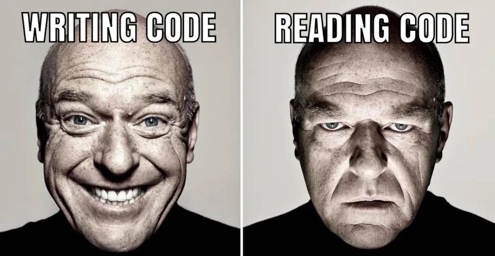
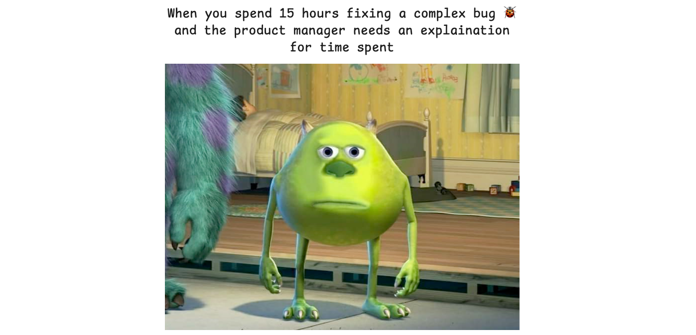
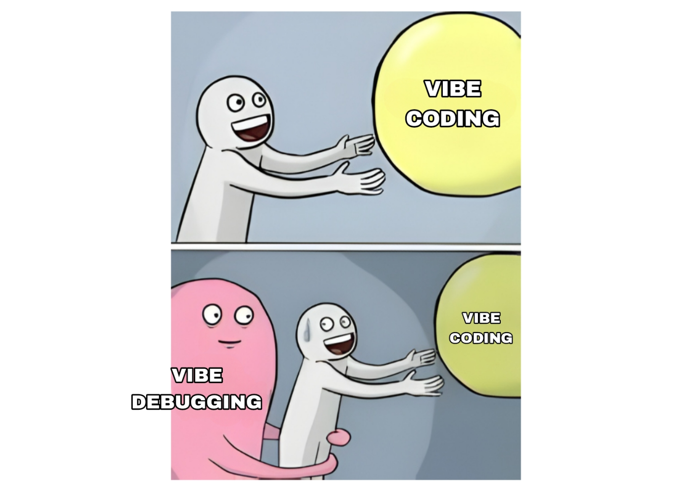
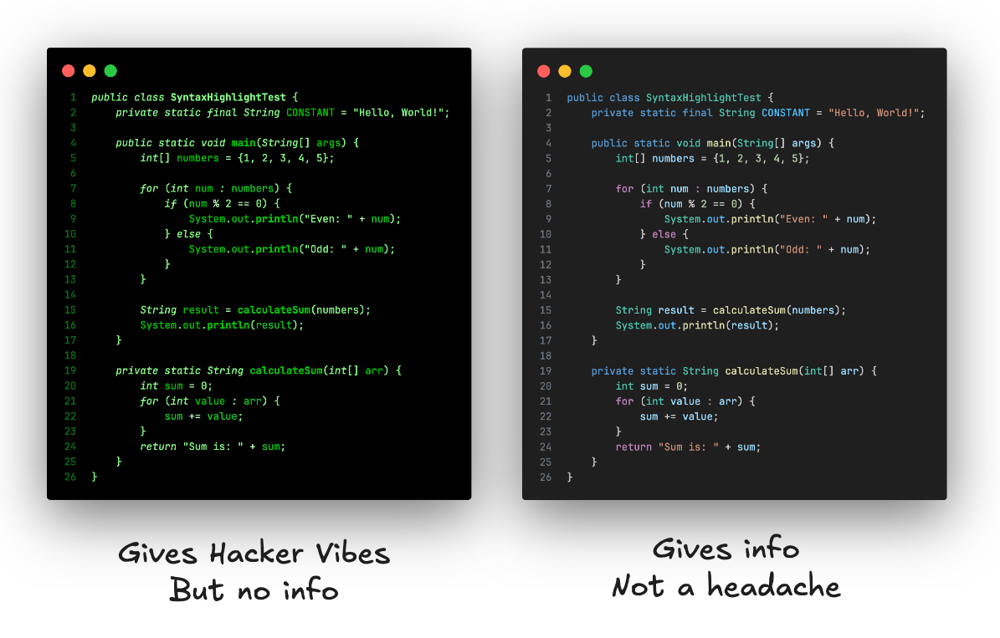
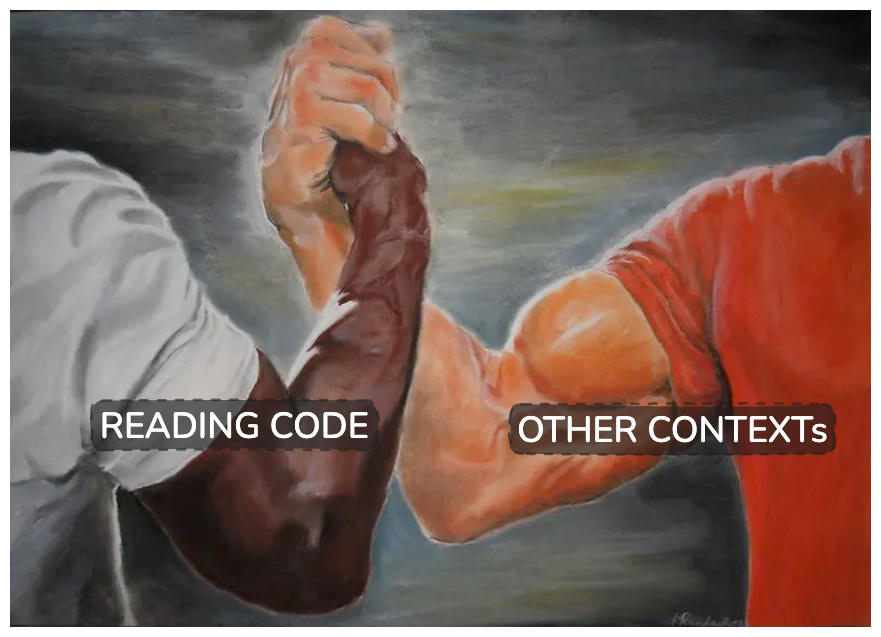
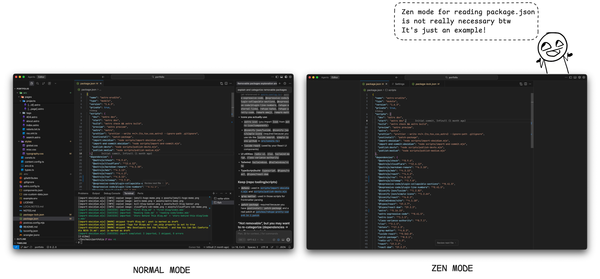
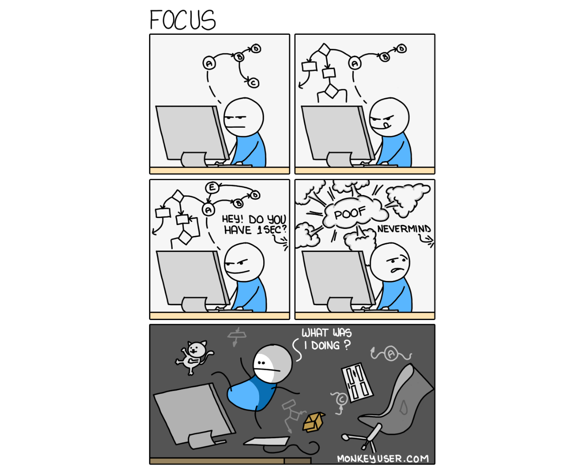

import Callout from '@/components/Callout.astro'

> A developer's job is 90% reading code and 10% writing it.

Almost every course found online, or taught in university is about writing code.  Clean code, best practices, class design patterns. All good stuff. But in reality we spend a huge chunk of our time in reading someone else's code, which is often neither clean nor documented.

Reading code isn't like reading a book, you go line by line, drop a single bookmark, and continue where you left off the next day. NO! It's messy, non-linear and you gotta load the entire flow into your mind. 

I wanna quote the term **Mind Map** here. Imagine exploring a new city, you start somewhere, walk through a couple of streets, visit some important places **the Supermarket**, **the Restaurant**. Slowly build your own map. You don't know every street, but you know the places that matter. Some roads are familiar, some are just *“I know it's around here”*, rest you ignore.

Reading code is just like that.

## Why Reading Code Feels Hard?

Think of our brain like a RAM. 

Every new file, every function forces you to load context into your brain. Not only that, you're required to also understand the code's intent by looking at variable names like `data`, `data_cleaned`, `data_cleaned_final` and functions like `process()`, `preProcess()`, `validate()` and god knows what. 

So now your brain isn’t just storing context. It’s resolving stuff like
- “Is `process()` the main logic or a helper?”
- “Why is `data_cleaned_final` still being modified?”
- “Which of these functions actually does the important thing?”

At this point, it’s no longer just a **Memory problem**. It’s a **CPU problem** too.

Reading code isn’t free. It’s **Computationally Expensive**. And requires some patience

> And this is where rewriting it **from scratch** starts to feel like a better idea. (or is it?)

## **Pros of Being Better at Reading Code**

### Makes you better at your 9-to-5 job

New project, new team, new repo - the fastest way to become useful isn't writing features. It's understanding flow.

Take a bugfix, for example, Your ability to write the perfect fix is secondary. What matters more is how fast you find the point of failure once the bug is discovered. That means loading context faster into your brain, identifying critical data from noisy logs, and tracing the buggy path through the codebase without getting lost.

The same goes when you're building a new feature. You’re not starting from a blank file. You’re navigating an existing system. Understanding edge cases, knowing which parts will be affected, and spotting where changes _should_ happen versus where they _merely could_ happen.

Nobody knows everything when they start. The real difference is how fast you can read and update your brain with the provided information, and update it as you go.
### AI Changed Writing Code. Not Understanding It

I’ll argue that **Reading code is a mandatory skill in the AI era**.

We now have vibe-coding tools which can spit out huge amount of code in seconds. Right now you can one-shot an entire full-stack app with a decent prompt. On the surface, it looks like the problem of _producing_ code is solved.

It isn't

AI didn't remove the need to understand code - it multiplied it. The **Feeback Loop** is the real bottleneck.

Every generated slop still needs to be read, reviewed, trimmed and given a feedback for update. If you can scan code quickly, spot bugs, notice repeated patterns, and identify unnecessary abstractions, you can make decisions faster - and faster decisions lead to better prompts, better iterations, and better code.

> Until AI can fully understand your intent, or we invent a way to absorb massive codebases instantly - **Reading code remains non-negotiable**.

## So How Do We Improve It?
Here's a few tips I learnt along the way, which helped me a lot
### 1. Better Syntax Highlighting

**Use a good theme.** It sounds like beginner advice, but it makes a real difference when reading code. Code is a mix of classes, variables, keywords, strings, and expressions - and your theme should help you distinguish these at a single glance, not make everything look the same for the sake of a “hacker vibe.”

**Consistency matters too.** Using one information-rich theme across all your tools reduces cognitive friction and helps your brain build familiarity faster. Personally, I find VS Code’s default theme surprisingly well-balanced and use it in IntelliJ and Neovim as well.

### 2. Use Every Context Available

The code you're reading is just the final snapshot. If your goal is just to understand the current behavior, that’s often enough. But if you’re trying to answer questions like - **how a bug happened**, **why a flawed change was approved**, or **how it even reached production**- the code alone won’t cut it. You need more data. You need **context**.

Start with **Git History**. Commit messages often contain intent, trade-offs, and time pressure. They explain why something changed, not just what changed.

Move on to **Pull requests (PRs) and Merge requests (MRs)** which contain even more info.  Discussions, Rejected ideas, and edge cases that shaped the final code. Many confusing bugs make perfect sense once you read the conversation around them.

When needed skim tickets, design notes - even outdated ones, because they reveal assumptions the code was built on.

### 3. Know your tool

Modern IDEs aren't just for improving writing code - they're powerful navigation tools too. Use the built-in features to improve your code reading.
- Use **Find Usages** and **Find References** to understand how a piece of code is used in the codebase
- Visualize File history & Blame to understand how code evolved
- Collapse / Expand code to see file structure at a glance
- Use Zen mode to remove distractions and maximize code focus when reading

### 4. Annotate the code
Reading code is a _process_. You don’t sit down, read top-to-bottom, and walk away enlightened. You forget. You come back. You lose context after a tea break. Or worse - after a weekend.

That's why annotation matters.

Write things down. Mark things (bookmark) in IDE. Leave breadcrumbs for your future self.

Use **pen and paper** to jot down important flows, assumptions, and "ohh, i see" stuff.

Inside your IDE, bookmarks and pins are insanely effective. They save minutes every time you jump back to a specific piece of code

Days later, you reopen the file, see the note, and instantly know where you were, even after a sudden meeting or a bit of small talk.

Personally I use a mix of both, bookmarking references in IDE rather than writing them in note. I pin important files instead of maintaining a separate "remember this later" list. For understanding flow, drawings beat text every time - whether it’s a quick sketch on paper or a rough board in Excalidraw or Obsidian Canvas.

### 5. Try not to judge the code, but learn from it

This is the last and most important one.

Judging code too early blocks understanding. The moment you label something as “bad” or “messy”, your brain stops exploring and starts resisting. 9 out of 10 times, the mess has it's reasons. And you usually uncover those reasons only by reading through it.

Reading messy code is valuable too. It shows you what not to do, which cases cause bugs and where assumptions may break. 

Starting from scratch isn’t always the right move
- Rename before refactoring
- Delete only after you know why it exists
- Rewrite only when you can clearly explain why the current version fails

A few minutes spent humbly reading the code often saves hours of confusion, frustration, and unnecessary reimplementation.

## Final Take

Reading code isn’t a secondary skill. **It is the job**.

So don't rush past reading. Every minute spent forming the mind map, saves hours of wrong implementation later.

Hope it helps!
